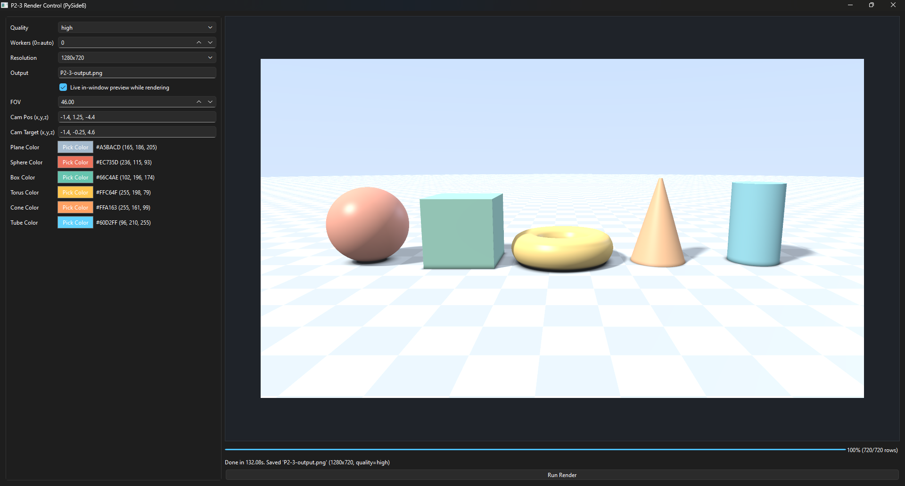
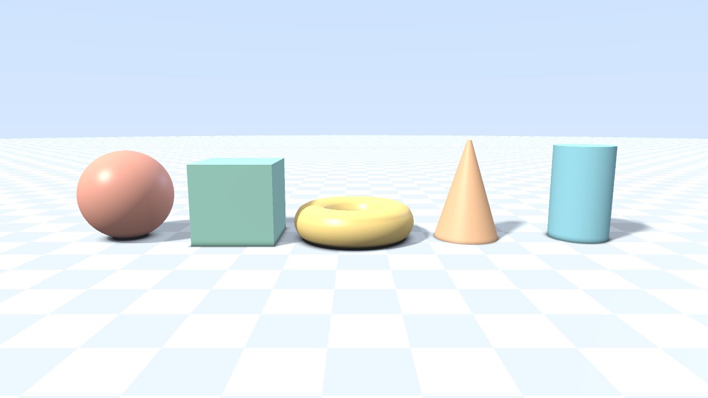

# CPU SDF Ray-Marching Renderer

This project is a CPU-based ray-marching renderer with a simple PySide6 GUI.

## Project Structure

```text
P2-3/
  launch_gui.bat         # main launcher (creates venv, installs deps, opens GUI)
  run_app.py              # optional compatibility launcher
  cpu_sdf_raymarcher/     # app package
    __init__.py
    __main__.py
    app/
      __init__.py
      cli.py
      config.py
      gui.py
    engine/
      __init__.py
      constants.py
      core.py
    common/
      __init__.py
      color_utils.py
      math_utils.py
      types.py
  docs/
    images/
      P2-3-GUI.png
      P2-3-output.png
  tests/
  pytest.ini
  requirements.txt
  README.md
```

## Requirements

- Python 3.10+ (recommended)
- Dependencies from `requirements.txt`

## Run

Main way (recommended):

```powershell
.\launch_gui.bat
```

What this does:
- Creates `.venv` if missing
- Installs `requirements.txt`
- Launches the GUI

Alternative launch methods:

```powershell
python run_app.py --gui
# or
python -m cpu_sdf_raymarcher --gui
```

Command-line render example (PNG only):

```powershell
python -m cpu_sdf_raymarcher --quality balanced --width 960 --height 540 --output render.png --sphere-color "#FF7755" --box-color "90,170,220"
```

Parallel render example (auto cores):

```powershell
python -m cpu_sdf_raymarcher --quality high --workers 0 --output render-fast.png
```

## CLI Options

```text
--quality {draft,balanced,high}
--output OUTPUT
--width WIDTH
--height HEIGHT
--workers WORKERS
--cam-pos X Y Z
--cam-target X Y Z
--cam-up X Y Z
--fov FOV
--plane-color COLOR
--sphere-color COLOR
--box-color COLOR
--torus-color COLOR
--cone-color COLOR
--tube-color COLOR
--gui
--no-progress
```

## Screenshots

GUI:



Rendered output:



Notes:
- Running with no arguments opens the GUI by default.
- In GUI mode, advanced render internals (epsilon, shadow steps, etc.) are set automatically from the selected quality preset.
- `--workers` uses process-based parallelism (`0` = auto core count, `1` = single worker).
- CLI color values accept `#RRGGBB`, `RRGGBB`, `0xRRGGBB`, or `R,G,B`.
- Colors are internally normalized to RGB tuples.
- Wheel sub-shapes share the same `--torus-color` for a simpler interface.
- GUI color rows show both formats for readability: `#RRGGBB (R, G, B)`.


